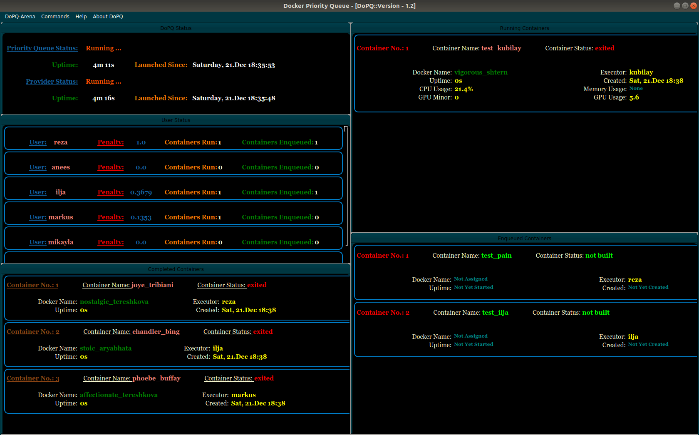

# DoP-Q
## Queue for docker to run projects on a multi-gpu machine ##

__History:__
+ 12.10.2017: Initial commit.
+ 16.10.2017: Changed to python 2.7
+ 31.01.2018: Refactored queue from the ground up. Introduced modules builder.py, container_handler.py, gpu_handler.py and helper_process.py

__Update:__
+ 15.04.2019: Decided to move in new interface for better flexibility and introduce server-client communication.
+ 21.06.2019: Beta version of Pyqt5 interface has been integrated to the backend.
+ 18.07.2019: Decided to separate the docker priority queue and provider process completely from the interface. Agreed to implement the system in MVC fashion with client totally separated from the server.

|
:---:|
_**New Interface of DoPQ [Beta Version]**_.|
